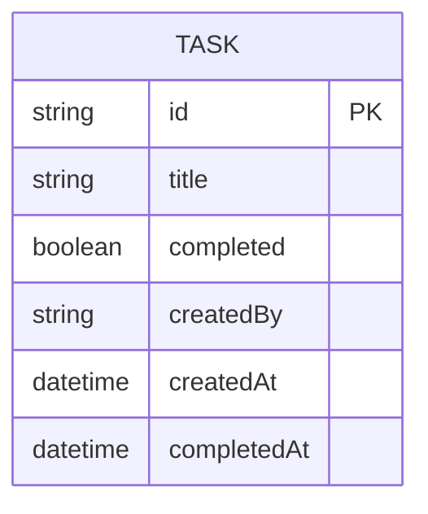

# Domain Model

The task board's data is a single entity: a task, created by an Admin and
later marked complete.

- `createdBy` records the Admin's user id from the sign-in token.
- `completedAt` is null until an Admin marks the task complete.

