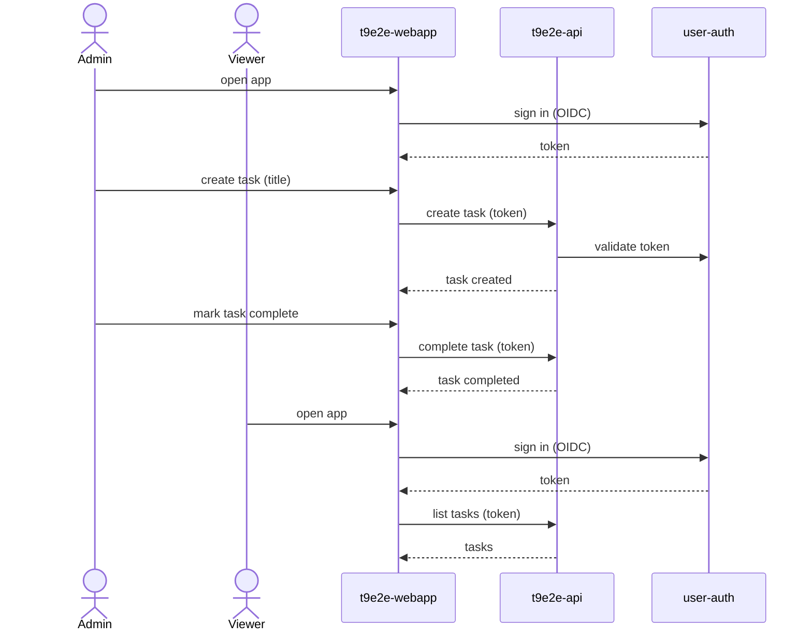

# Admin creates and completes a task

An Admin signs in, adds a task to the shared board, and later marks it
complete; a Viewer signs in and sees the board update.

```mermaid
sequenceDiagram
    actor Admin
    actor Viewer
    participant t9e2e as t9e2e-webapp
    participant api as t9e2e-api
    participant auth as user-auth

    Admin->>t9e2e: open app
    t9e2e->>auth: sign in (OIDC)
    auth-->>t9e2e: token
    Admin->>t9e2e: create task (title)
    t9e2e->>api: create task (token)
    api->>auth: validate token
    api-->>t9e2e: task created
    Admin->>t9e2e: mark task complete
    t9e2e->>api: complete task (token)
    api-->>t9e2e: task completed
    Viewer->>t9e2e: open app
    t9e2e->>auth: sign in (OIDC)
    auth-->>t9e2e: token
    t9e2e->>api: list tasks (token)
    api-->>t9e2e: tasks
```

